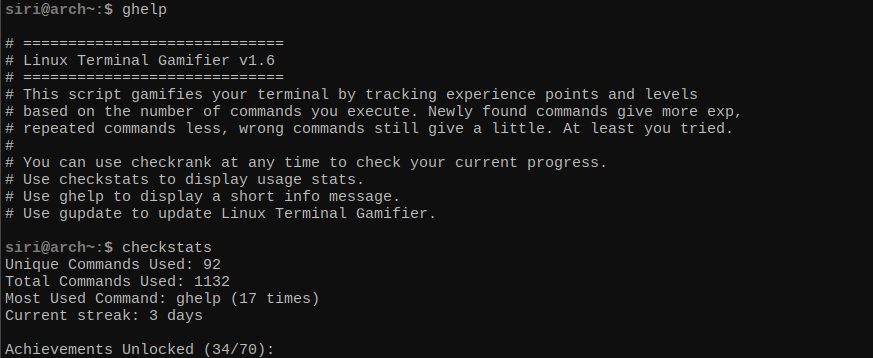

# Linux Terminal Gamifier




This script gamifies your terminal by tracking experience points and levels based on the number of commands you execute. Newly found commands give more EXP, repeated commands give less, and even incorrect commands still grant a small amount—at least you tried. Contains 14 unlockable ranks and 70 achievements.

## Setup

1. Save this file in your home directory (or anywhere else):
   ```bash
   curl --output ~/gamifier "https://raw.githubusercontent.com/Divinux/linux-terminal-gamifier/refs/heads/main/gamifier"
   ```
2. Source the file in your `.bashrc`. This can be done manually or (assuming you saved it in your home directory) by running:
   ```bash
   echo 'source ~/gamifier' >> ~/.bashrc
   ```
3. Ensure your history is reloaded after each command, then call `update_exp`. If you have not yet modified your `PROMPT_COMMAND`, you can simply run:
   ```bash
   echo 'export PROMPT_COMMAND="history -a; history -n; update_exp; $PROMPT_COMMAND"' >> ~/.bashrc
   ```
4. Restart your terminal or run:
   ```bash
   source ~/.bashrc
   ```

## Additional Information

- This script creates a directory under `$XDG_DATA_HOME` (defaults to `~/.local/share/` if `$XDG_DATA_HOME` is not set) with three additional files:
  - `.exp`: Tracks the current experience amount and level.
  - `.usedcommands`: Contains all commands the user has used so far.
  - `.achievements`: Tracks the status of all achievements.
- To continue tracking your progress on a new install, just copy this directory over.
- You may want to increase your `HISTSIZE` and `HISTFILESIZE`.
  - Setting them to nothing, i.e., `HISTSIZE=` and `HISTFILESIZE=`, makes them unlimited.
- Use `checkrank` at any time to check your current progress.
- Use `checkstats` to display usage stats.
- Use `ghelp` to display a short info message.
- Found to work well with [bashcrawl](https://gitlab.com/slackermedia/bashcrawl), a terminal commands learning adventure game.

## Uninstall

1. Remove `source ~/gamifier` and `update_exp;` from your `.bashrc`.
2. Delete the `gamifier` file and the `~/.local/share/gamifier` directory.
3. Restart your terminal.


